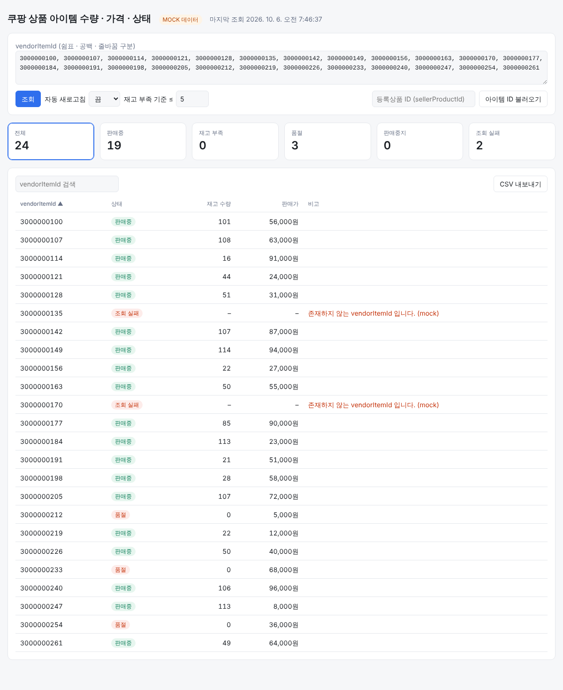

# 쿠팡 SKU 대시보드

쿠팡 Wing Open API의 **상품 아이템별 수량/가격/상태 조회** API를 이용해 여러 아이템(vendorItemId)의
재고 수량, 판매가, 판매 상태를 한 화면에서 보는 대시보드입니다.



## 기능
- vendorItemId 여러 개를 한 번에 조회 (최대 500개, 동시 요청 3개로 제한)
- 등록상품 ID(sellerProductId)를 넣으면 하위 아이템 vendorItemId를 자동으로 채움
- 상태 요약 카드: 전체 / 판매중 / 재고 부족 / 품절 / 판매중지 / 조회 실패 (카드를 누르면 필터)
- 재고 부족 기준 설정, 정렬, 검색, CSV 내보내기(엑셀 호환), 자동 새로고침(1·5·15분)
- API 키가 없으면 MOCK 데이터로 동작해서 화면부터 확인 가능

## 가장 쉬운 실행 방법
1. [Node.js](https://nodejs.org) LTS 설치
2. 이 저장소를 ZIP으로 내려받아 압축 해제
3. Windows는 `start-windows.bat`, Mac은 `start-mac.command` 더블클릭
4. 처음 한 번 업체코드 · Access Key · Secret Key 붙여넣기 → 자동으로 연결 점검 후 대시보드가 열림

## 실행 (터미널)
Node.js 18 이상만 있으면 됩니다. (외부 패키지 없음)

```bash
cp .env.example .env   # 키 입력
npm run check          # 키 · IP · API 연결 점검 (상품 목록 → 아이템 → 수량/가격/상태)
npm start              # http://localhost:3000
npm test
```

## 구조
```
server.js          정적 파일 제공 + 쿠팡 API 프록시 (시크릿 키는 서버에만 보관)
lib/coupang.js     HMAC-SHA256 서명, API 경로, 응답 정규화, Mock 클라이언트
public/index.html  대시보드 화면
```

브라우저에서 쿠팡 API를 직접 부를 수 없고(CORS, 시크릿 키 노출) 쿠팡은 **등록된 IP**에서만 호출을
허용하므로, 반드시 Wing에 IP를 등록한 서버에서 `server.js`를 실행하세요.

## 사용 API
| 용도 | Method | Path |
|---|---|---|
| 아이템별 수량/가격/상태 조회 | GET | `/v2/providers/seller_api/apis/api/v1/marketplace/vendor-items/{vendorItemId}/inventories` |
| 상품 조회 (아이템 목록) | GET | `/v2/providers/seller_api/apis/api/v1/marketplace/seller-products/{sellerProductId}` |

응답의 `data.amountInStock`(재고), `data.salePrice`(판매가), `data.onSale`(판매 여부)를 사용합니다.
경로나 필드명이 공식 문서와 다르면 `lib/coupang.js`의 `PATHS`와 `normalizeInventory`만 수정하면 됩니다.
